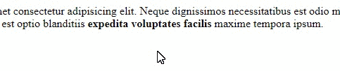
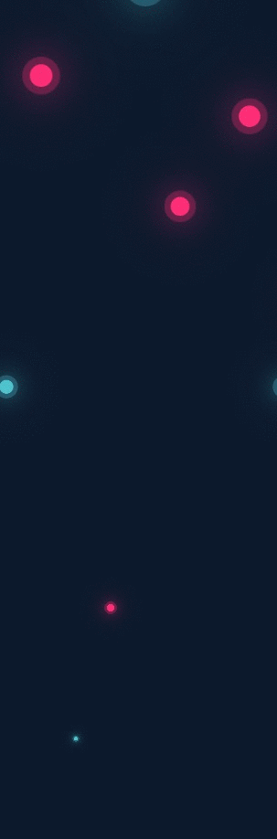

This repository is mini practice and templates for CSS:

1. Animation gradient linear under text. При наведении на выделенное жирным слова (ссылка), снизу текста появляется линия градиента 

2. Animation background gradient.

3. Animation background bubbles.

